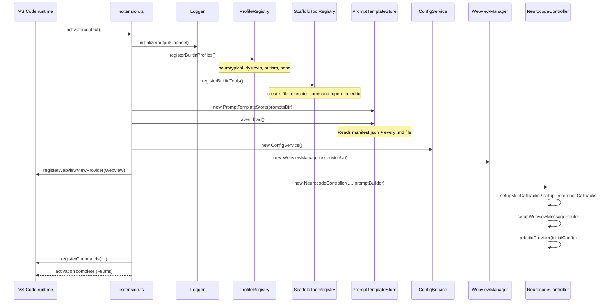
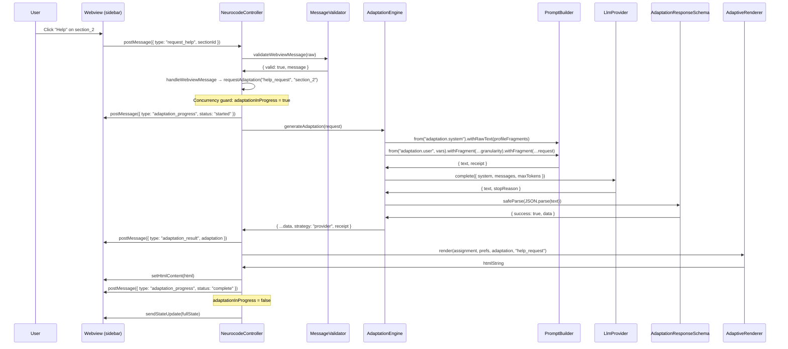
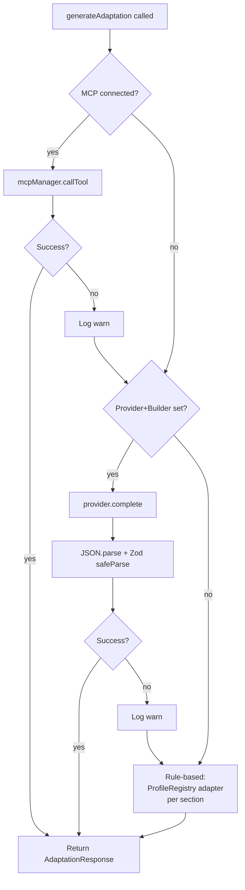
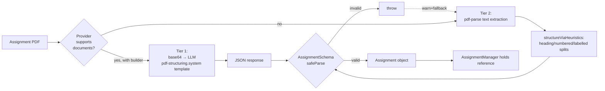
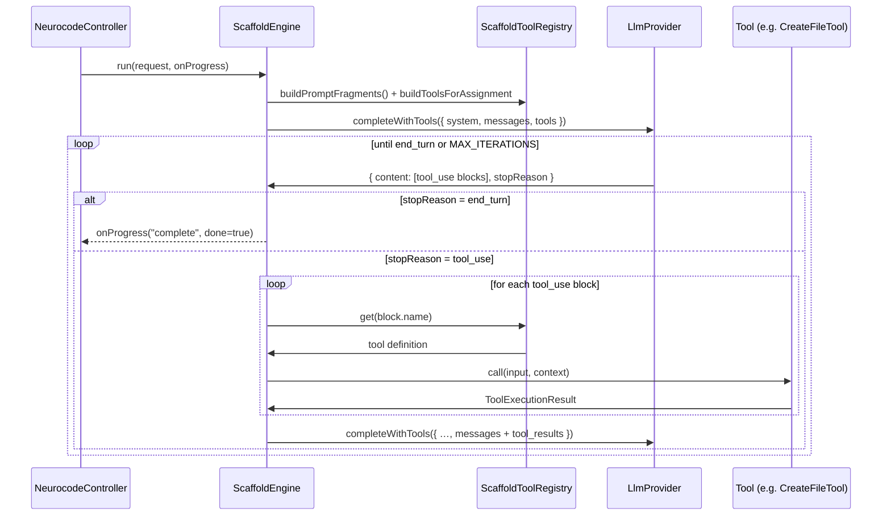

# Architecture

This document describes the runtime structure, data flow, and key design
decisions of NeuroCode Adapter. It's written to serve both as an
onboarding guide for future contributors and as a reference for the
thesis Design chapter.

## Design goals

The refactor had three advisor-prioritised goals:

1. **Testability** — every subsystem should be independently exercisable
   without VS Code instantiation
2. **Maintainability** — prompt content, UI copy, and schema validation
   should be edit-without-recompile
3. **Extensibility** — adding a new profile, LLM provider, MCP server,
   or scaffold tool should be a single-file change

These shape every design decision below.

## Component overview

The extension is structured into four layers. Dependencies point
downward: `core` depends on `features`, `features` depends on `services`,
all depend on `shared`.

```mermaid
flowchart TB
    subgraph Entry[extension.ts]
        activate[activate&#40;&#41;]
    end

    subgraph Core[core/ — orchestration]
        Controller[NeurocodeController]
        Webview[WebviewManager]
    end

    subgraph Features[features/ — domain logic]
        AdaptRenderer[AdaptiveRenderer]
        AssignmentMgr[AssignmentManager]
        PrefMgr[PreferenceManager]
        ScaffoldEng[ScaffoldEngine]
    end

    subgraph Services[services/ — integrations]
        AdaptationEngine
        PromptSubsys[Prompt subsystem]
        LlmProv[LlmProvider]
        McpMgr[McpManager]
    end

    subgraph Shared[shared/ — types and cross-cutting]
        Schemas[Zod schemas]
        ProfileReg[ProfileRegistry]
        ConfigSvc[ConfigService]
        Logger
    end

    activate --> Controller
    activate --> Webview
    activate --> PromptSubsys

    Controller --> AdaptRenderer
    Controller --> AssignmentMgr
    Controller --> PrefMgr
    Controller --> ScaffoldEng
    Controller --> AdaptationEngine
    Controller --> McpMgr
    Controller --> Webview
    Controller --> ConfigSvc

    AdaptationEngine --> LlmProv
    AdaptationEngine --> PromptSubsys
    AdaptationEngine --> McpMgr
    AssignmentMgr --> LlmProv
    AssignmentMgr --> PromptSubsys
    ScaffoldEng --> LlmProv

    AdaptRenderer --> ProfileReg
    AdaptationEngine --> ProfileReg
    PrefMgr --> ProfileReg

    Services --> Schemas
    Features --> Schemas
    Core --> Schemas
```

### Responsibility of each component

**`extension.ts`** — VS Code lifecycle entry point. Loads the prompt
template store, instantiates services in dependency order, wires
commands.

**`NeurocodeController`** — central orchestrator. Owns every subsystem,
routes webview messages to the right handler, publishes state back to
the webview after every change. Inspired by Cline's Controller class.

**`WebviewManager`** — manages the sidebar webview panel lifecycle.
Buffers outbound messages until the webview resolves; validates inbound
messages via `validateWebviewMessage` before forwarding to handlers.

**`AdaptiveRenderer`** — pure transform from `(Assignment,
UserPreferences, AdaptationResponse?)` to a complete HTML string.
Delegates per-section rendering to `SectionRendererRegistry` so custom
section renderers can be plugged in.

**`AdaptationEngine`** — three-strategy fallback chain for LLM
adaptation: MCP tool → direct provider → rule-based. Composes prompts
via `PromptBuilder`, validates responses via Zod
`AdaptationResponseSchema`, returns `AdaptationResponseWithReceipt` that
records which template versions produced the output.

**`AssignmentManager`** — imports PDF assignments using `parser.ts`,
which attempts Tier 1 (direct PDF to LLM) and falls back to Tier 2
(heuristic text parsing). Tracks per-assignment progress state in
`context.globalState`.

**`PreferenceManager`** — loads, saves, and broadcasts user preferences.
Sync from VS Code settings, fires change callbacks on profile switch.

**`ScaffoldEngine`** — agentic loop that calls the LLM with tool
definitions, executes tools via `ScaffoldToolRegistry`, feeds results
back. Inspired by Claude Code's query loop.

**`ProfileRegistry`** — map of `NeurodiversityType → NeurodiversityModule`.
Adding a profile = one `ProfileRegistry.register()` call; every consumer
(renderer, engine, preferences) picks it up automatically.

**Prompt subsystem (`services/prompts/`)** — `PromptTemplate` +
`PromptTemplateStore` + `PromptBuilder`. See
[docs/prompts.md](prompts.md) for detailed design.

## Activation sequence

When VS Code activates the extension, subsystems initialise in a
specific order. Each step depends on the previous:

## Core workflow: assignment adaptation

The most important runtime path. User clicks "Get AI Help" on a section;
here's what happens end-to-end:

### Fallback behaviour

If the direct provider call fails (network error, API error, malformed
JSON, schema validation failure), `AdaptationEngine` falls back through
the strategy chain:

Each path produces an `AdaptationResponseWithReceipt` whose `strategy`
field records which path succeeded. This is the data the Evaluation
chapter can use to report "X% of adaptations used the LLM path, Y%
rule-based fallback".

## PDF assignment parsing

Two-tier pipeline inside `features/assignments/parser.ts`:

**Tier 1** preserves formulas, tables, and layout because the LLM sees
the PDF directly. **Tier 2** uses deterministic text-based heuristics
(markdown-style headings, numbered lists, labelled prefixes like
"Task 1:"). Tier 2 is the offline-safe path; Tier 1 is the default when
an Anthropic-style provider is configured.

## Scaffold workflow

`ScaffoldEngine` implements an agentic tool-use loop. Given an
assignment, the LLM is asked to create a starter project; it does this
by calling one or more tools (`create_file`, `execute_command`,
`open_in_editor`) until it reports `end_turn`.

Each iteration, `ScaffoldEngine` appends the assistant message and the
tool results to the message history, so the model sees the growing
conversation on each step.

## State management

The controller holds a small `AdaptationState`:

- `isAdapting` — LLM call in flight
- `isStreaming` — currently reading the response
- `lastAdaptationTimestamp`
- `abandonedAdaptation` — set by `clearSession` while adaptation is
  in flight

Additionally, `adaptationInProgress` is a boolean concurrency guard that
prevents duplicate requests from spam-clicking the "Get Help" button.

Persistent state lives in VS Code `context.globalState`:

- `neurocode.assignmentProgress` — `Record<assignmentId, ProgressRecord>`
- `neurocode.userPreferences` — the current `UserPreferences` object

## Key design patterns

| Pattern | Where | Why |
|---|---|---|
| Registry | `ProfileRegistry`, `SectionRendererRegistry`, `ScaffoldToolRegistry` | Add a new kind of X with one `register()` call, no switch chains to edit |
| Strategy | `AdaptationEngine.generateAdaptation` (MCP → provider → rule-based) | Graceful degradation when services are unavailable |
| Builder | `PromptBuilder` / `PromptDraft` | Advisor-requested pattern for composing prompts from fragments without if/else chains |
| Factory | `ProviderFactory.createProvider` | Provider instantiation hidden from consumers |
| Observer | `ConfigService.onChange`, `PreferenceManager.onPreferencesChanged`, `McpManager.onStatusChange` | Callback-based broadcasting of state changes |
| Facade | `shared/types.ts` re-exports Zod-inferred types | Backward-compatible type surface while migrating to schema-driven types |

## Testing strategy

Test organisation mirrors the source tree — `src/foo/__tests__/foo.test.ts`
for every significant module. Test philosophy:

- **Schemas** — test the contract (accept valid, reject invalid, coerce
  where declared). `AdaptationResponseSchema.test.ts` pins down every
  fallback case.
- **Pure functions** — test directly (`escapeHtml`, `markdownToHtml`,
  `classifySectionTitle`, `buildStrategy`).
- **Registries** — test register / get / throw / clear in isolation
  using a lightweight factory.
- **Integration** — `PromptTemplateStore.test.ts` reads real templates
  from disk and verifies the manifest round-trip (every `{{var}}` used
  by a template is declared in the manifest).

What is *not* tested directly (by design):

- End-to-end VS Code webview interaction — requires a real VS Code
  instance; done manually during development
- LLM calls — mocked or skipped; the engine is tested with a stub
  provider
- PDF binary parsing — `pdf-parse` is treated as a black box; we test
  `structureViaHeuristics` with synthetic text

## References

- `docs/prompts.md` — PromptTemplate + PromptBuilder design
- `docs/extending.md` — how-to recipes for common extensions
- `docs/CONTROLLER_DIFF.md` — historical: M1 controller migration
- `docs/VALIDATOR_PATCHES.md` — historical: M2 validator migration
