# Prompt templates and the Builder pattern

This document describes the prompt subsystem introduced in M1 and the
rationale behind each design decision. Written to serve as a reference
for the thesis Design chapter.

## Problem statement

Before M1, every LLM prompt in the codebase was a hardcoded string
literal inside a `.ts` file:

- `AdaptationEngine.ts` had a top-level `SYSTEM_PROMPT_PREFIX` constant
  and a `buildAdaptationPrompt()` function that concatenated strings
  with `prompt += "..."`.
- `parser.ts` had a `PDF_STRUCTURING_PROMPT` constant.
- Profile-specific variations went through if/else chains:
  `if (granularity === "combined") { prompt += "..."; }`.

This had four concrete problems:

1. **Editing a prompt required recompiling the extension.** Researchers
   and educators — not only software engineers — needed to tune prompt
   wording. The extension build cycle is a significant barrier.
2. **Prompt versions were untrackable.** If a student reported a bad
   adaptation yesterday and the prompt had changed since, there was no
   audit trail linking the output to the prompt that produced it.
3. **A/B testing and ablation studies were impossible.** The Evaluation
   chapter wants to ask "does detailed granularity improve completion
   rate vs combined?". With hardcoded prompts and no provenance, this
   experiment is not recoverable from logs.
4. **Adding a new axis of variation required editing the engine.**
   The advisor's explicit example was adding rubric-driven task
   breakdown: under the old architecture, it meant editing
   `buildAdaptationPrompt` and adding a third if/else branch.

The advisor requested specifically the **Builder pattern** to address
these (citing the Gang of Four's MealBuilder example in the 10-April
meeting).

## Solution architecture

Three layers:

```mermaid
flowchart LR
    Manifest[manifest.json] -->|read by| Store[PromptTemplateStore]
    Templates[*.md files] -->|read by| Store
    Store -->|get&#40;id&#41;| Template[PromptTemplate]
    Template -->|used by| Draft[PromptDraft]
    Store -.->|wraps| Builder[PromptBuilder]
    Builder -->|from&#40;id&#41;| Draft
    Draft -->|build&#40;&#41;| Output[BuildResult&lt;text, receipt&gt;]
```



### Layer 1: `PromptTemplate`

A single template file. Responsibilities:

- Hold the raw template body (read from disk once)
- Hold metadata: `id`, `version`, `requiredVars`
- Render by substituting `{{ placeholder }}` with provided values
- Enforce strict-mode variable contracts (fail loudly on violations)

Placeholder syntax is intentionally minimal: `{{ name }}` with optional
whitespace, matching `\w+`. No loops, conditionals, or filters.

**Why a class with identity, not a function?** Because each template has
a version that must travel with its rendered output for evaluation
telemetry. A function over raw strings loses that provenance.

**Why strict-mode?** Two failure modes to guard against:

- **Missing required var**: the manifest says `requiredVars: ["profile"]`
  but the caller passed `{}`. Fail immediately — in the old code, a
  missing `${profile}` would silently produce `undefined` in the prompt,
  leading to confusing LLM behaviour.
- **Unknown referenced var**: the template body has `{{extra}}` but
  `extra` is neither in `requiredVars` nor provided at render time.
  Fail — this catches mid-edit typos ("I renamed the var in the
  template but forgot the manifest").

### Layer 2: `PromptTemplateStore`

Reads `manifest.json` at activation, loads every referenced `.md` file
in parallel, caches them in-memory.

**Why load once at activation?** Activation is already doing I/O
(reading VS Code config, restoring global state). Reading ~10 small
markdown files adds <10 ms on typical hardware. In return, every
subsequent LLM call assembles prompts with zero I/O — critical because
prompts may be composed many times per user session.

**Manifest-driven registration.** Instead of `import`-ing prompt files
at build time, the manifest is read at runtime. This is what makes
prompts editable without recompilation: change a `.md` file, reload the
extension, done. The `NEUROCODE_PROMPT_HOTRELOAD=1` dev env even
removes the reload step via `fs.watch`.

**Manifest schema**:

```json
{
  "manifestVersion": "1.0.0",
  "templates": {
    "adaptation.system": {
      "path": "adaptation/system.md",
      "version": "1.0.0",
      "description": "...",
      "requiredVars": []
    },
    ...
  }
}
```

Each entry has its own version. When a researcher changes a template
body, they also bump the template's version, and the manifest version
if the change is semantically significant. This makes every
`BuildReceipt` self-describing.

### Layer 3: `PromptBuilder` / `PromptDraft`

The advisor-requested Builder. Consumers never construct prompts by
hand; they describe a configuration and hand it to the builder:

```ts
const { text, receipt } = promptBuilder
  .from("adaptation.user", vars)
  .withFragment(`adaptation.fragment.granularity.${granularity}`)
  .withFragment(`adaptation.fragment.request.${requestType}`)
  .build();
```

The granularity and request-type axes are now **data-driven** — the
template ID is derived from runtime values — rather than encoded as
branches in `AdaptationEngine`. Adding a new granularity value
(e.g. `rubric-driven`) is a new fragment file plus one enum update.

**What fluent API buys us** beyond direct string concatenation:

- **Uniform contract** — every fragment goes through the same
  `withFragment()` call, so authoring, testing, and telemetry treat
  them identically.
- **Inheritance of base vars** — a fragment sees the base template's
  vars without re-specifying them; extra vars can be passed to the
  fragment specifically.
- **Optional fragments** — `.withOptionalFragment()` is a safe no-op
  when the template doesn't exist, useful for forward-compatible
  fragment addition.
- **Receipt collection** — each `.withFragment()` silently appends to
  the internal receipt log. At `.build()` time, we have a complete
  record of what contributed to the output.

### The `BuildReceipt`

Every `.build()` returns `{ text, receipt }`. The receipt:

```ts
{
  manifestVersion: "1.0.0",
  templates: [
    { id: "adaptation.system", version: "1.0.0" },
    { id: "profile.registry", version: "runtime" },
    { id: "adaptation.user", version: "1.0.0" },
    { id: "adaptation.fragment.granularity.detailed", version: "1.0.0" },
    { id: "adaptation.fragment.request.help_request", version: "1.0.0" },
  ]
}
```

`AdaptationEngine` attaches this to every `AdaptationResponseWithReceipt`.
The Evaluation chapter can then ask questions that were previously
impossible:

- "Out of 100 help requests, how many used `granularity=detailed`?"
- "Did `user@1.1.0` perform measurably better than `user@1.0.0`?"
- "For `adhd` profile specifically, which granularity setting has the
  highest student task-completion rate?"

The raw receipt data, logged alongside adaptation outputs, is the
primary input to the M3 telemetry module (not yet implemented).

## Profile fragments: the one compromise

Neurodiversity profile prompt fragments (the per-type text
like "For dyslexic readers, use OpenDyslexic font...") are **not** in
the template system. They live on `NeurodiversityModule.promptFragment`
strings in `builtinProfiles.ts`, merged at runtime via
`ProfileRegistry.buildCombinedPromptFragments()`.

**Why the exception?** Profile fragments are runtime-registered: adding
a new profile already requires a code change (a new
`ruleBasedAdapter` function). Moving its prompt text to
`resources/prompts/` would separate two co-located concerns and require
registering both a profile and a template.

The `AdaptationEngine.buildSystemPrompt()` injects them via
`withRawText(profileFragments, { id: "profile.registry", version: "runtime" })`,
which *does* include them in the receipt — just under a synthetic ID
that makes the situation visible.

## Testing approach

Three test files, progressing from unit to integration:

- **`PromptTemplate.test.ts`** — every behaviour of a single template
  in isolation: substitution, strict-mode violations, whitespace
  tolerance, repeated placeholders.
- **`PromptBuilder.test.ts`** — composition behaviour with a fake
  in-memory store. Fluent chaining, var inheritance, fragment-specific
  overrides, receipt collection, error propagation.
- **`PromptTemplateStore.test.ts`** — real filesystem, real tmpdir
  fixtures. Covers manifest parsing, malformed JSON, missing files,
  idempotent load, forced reload. Includes a **round-trip check**
  against the *actual* `resources/prompts/` directory: every `{{var}}`
  in every template must be declared in the manifest. This catches the
  common authoring mistake of adding a placeholder without updating
  the manifest.

## Checklist: adding a new fragment

1. Write the fragment to `resources/prompts/<area>/fragments/<name>.md`
2. Add an entry to `resources/prompts/manifest.json` with
   `path`, `version: "1.0.0"`, `requiredVars: [...]`
3. Call `.withFragment("<fragment-id>")` from the appropriate builder
   site in `AdaptationEngine.buildUserPrompt()` (or a new location)
4. Run `npx jest src/services/prompts` — the round-trip test verifies
   your manifest entry matches the placeholders in the file

Four steps, all localised, no engine edits. This is what the advisor
was asking for.
